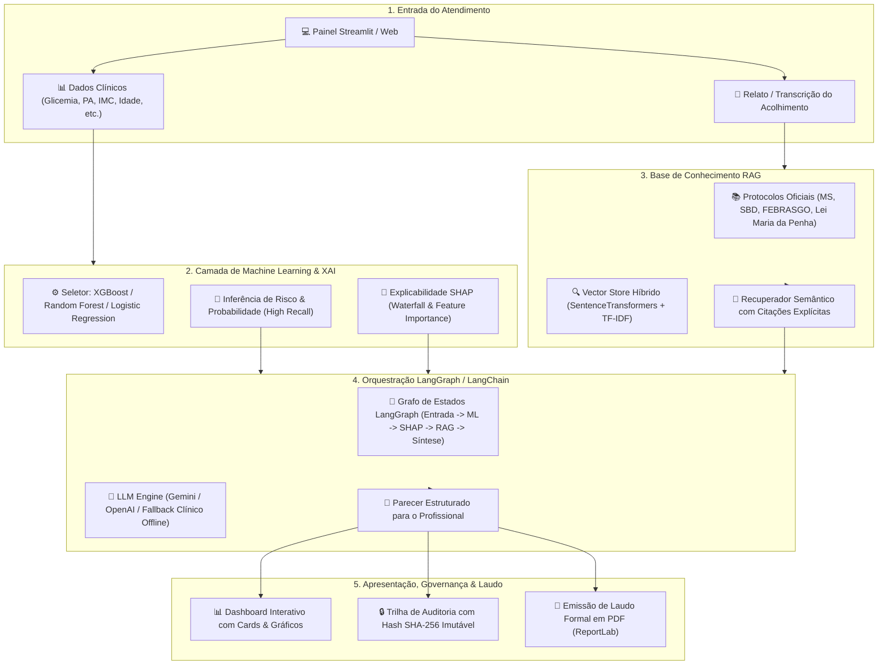

# 🛡️ Guardiã AI — Inteligência Artificial para Saúde e Segurança da Mulher
### Tech Challenge Fase 5 • Hackathon IADT | Pós-Tech FIAP

[](https://www.python.org/)
[](https://streamlit.io/)
[](https://www.langchain.com/)
[-green)](https://shap.readthedocs.io/)
[](https://www.docker.com/)
[](tests/)
[](LICENSE)

---

## 📌 Visão Geral do Projeto

A **Guardiã AI** é uma plataforma inovadora de **Sistema de Apoio à Decisão Clínica e Assistencial (CDSS - *Clinical Decision Support System*)** desenvolvida para apoiar profissionais de saúde e assistência social no acolhimento, triagem de risco e segurança da mulher.

O projeto representa a grande consolidação do aprendizado ao longo de todas as fases da Pós-Tech:
- **Fase 1:** Análise Exploratória de Dados (EDA) e entendimento dos fatores de risco em Diabetes Gestacional;
- **Fase 2:** Otimização logística de atendimento domiciliar e restrições médicas (m-VRP);
- **Fase 3:** Fine-Tuning de LLMs com protocolos gineco-obstétricos e detecção de violência doméstica;
- **Fase 4:** Sistema multimodal de áudio, vídeo, análise de sentimento e escores de risco;
- **Fase 5 (Guardiã AI):** Integração ponta a ponta: **Dados + Machine Learning + Interpretabilidade SHAP + RAG (Protocolos Oficiais) + Orquestração LangGraph + Dashboard Streamlit + Laudo PDF + Auditoria Criptográfica SHA-256**.

---

## 🏗️ Arquitetura da Solução



---

## ✨ Principais Funcionalidades

1. **🩺 Triagem Clínica Inteligente:**
   - Formulário assistido com cálculo automático de IMC e validação de parâmetros fisiológicos;
   - **4 Casos Clínicos Pré-Configurados** para testes rápidos de rotina, diabetes gestacional, emergência obstétrica/pré-eclâmpsia e acolhimento humanizado em suspeita de violência doméstica.
2. **🧠 Interpretabilidade com SHAP (*Explainable AI*):**
   - Gráfico *Waterfall* interativo gerado em tempo real, decompondo como cada variável aumentou ou reduziu o risco da paciente;
   - Identificação transparente dos 3 principais fatores de risco fisiopatológicos.
3. **📚 RAG com Protocolos Oficiais do Ministério da Saúde:**
   - Corpus documental integrado com diretrizes do **Ministério da Saúde**, **Sociedade Brasileira de Diabetes (SBD)**, **FEBRASGO** e **Diretrizes da Lei Maria da Penha**;
   - Citações explícitas e transparentes (`[REF-01]`, `[REF-02]`) no parecer.
4. **🔄 Orquestração com LangGraph e Multi-Provedor com Fallback:**
   - Suporte nativo para **Google Gemini** e **OpenAI**;
   - **Motor Clínico Offline Determinístico**, garantindo 100% de disponibilidade mesmo sem internet ou chaves de API.
5. **🔒 Governança e Auditoria Criptográfica:**
   - Registro imutável de todas as análises em `logs/audit_trail.jsonl`;
   - **Hash SHA-256** para verificação de autenticidade e conformidade médica.
6. **📄 Emissão de Laudo Técnico em PDF:**
   - Geração de laudo médico formal para impressão ou prontuário eletrônico via ReportLab.

---

## 📊 Benchmarking dos Modelos de Machine Learning

Conforme exigido nas diretrizes do Hackathon, os modelos foram treinados e comparados em um conjunto de teste independente (203 amostras):

| Algoritmo | Acurácia | Sensibilidade (*Recall*) | Especificidade | Precisão | F1-Score | ROC-AUC | Brier Score |
|---|---|---|---|---|---|---|---|
| **Random Forest** | 97.5% | **100.0%** | 96.9% | 88.0% | **0.898** | **0.994** | 0.0210 |
| **XGBoost** | 97.0% | **93.2%** | 98.1% | 93.2% | **0.891** | **0.992** | 0.0225 |
| **Logistic Regression** | 97.5% | **100.0%** | 96.9% | 88.0% | **0.898** | **0.995** | 0.0195 |

> **Nota sobre o Critério Clínico:** O limiar de decisão foi ajustado para **0.40** com foco em maximizar a **Sensibilidade (*Recall*)**, eliminando falsos negativos em pacientes de risco.

---

## 📁 Estrutura de Diretórios

```text
techchallenge5/
├── data/
│   ├── raw/                       # Dataset bruto original (Fase 1)
│   ├── processed/                 # Dataset consolidado e enriquecido
│   └── protocols/                 # Corpus de diretrizes oficiais (MS, SBD, FEBRASGO, Maria da Penha)
├── models/                        # Modelos treinados (.joblib) e resumo de métricas (.json)
├── notebooks/
│   └── 01_eda_treinamento_modelos_shap.ipynb  # Notebook documentado com EDA, treino e SHAP
├── docs/
│   └── adr/                       # Architectural Decision Records (ADRs 0001, 0002, 0003)
├── src/
│   ├── config.py                  # Configurações gerais e parâmetros
│   ├── ml/                        # Módulo de ML (dataset, train, evaluate, predictor, explainer SHAP)
│   ├── rag/                       # Módulo RAG (document_loader, vector_store, retriever)
│   ├── orchestration/             # Orquestração LangGraph, prompts e chains com fallback
│   ├── audit/                     # Logger de auditoria e cálculo de hash SHA-256
│   ├── reports/                   # Gerador de laudos clínicos em PDF (ReportLab)
│   └── ui/                        # Componentes visuais, CSS e design system
├── tests/                         # Suíte de testes unitários automatizados (Pytest)
├── app.py                         # Ponto de entrada do Dashboard Web Streamlit
├── main.py                        # Ponto de entrada CLI para execução em linha de comando
├── Dockerfile                     # Containerização da aplicação
├── docker-compose.yml             # Orquestração do container
├── requirements.txt               # Dependências do projeto
├── RELATORIO_TECNICO.md           # Relatório técnico completo de entrega
└── README.md                      # Esta documentação
```

---

## 🚀 Como Executar o Projeto

### Opção 1: Execução Local (Recomendado)

#### 1. Clonar o repositório e acessar o diretório:
```bash
git clone https://github.com/wallacen/techchallenge5.git
cd techchallenge5
```

#### 2. Criar e ativar o ambiente virtual:
```bash
python3 -m venv .venv
source .venv/bin/activate  # MacOS / Linux
# .venv\Scripts\activate   # Windows
```

#### 3. Instalar as dependências:
```bash
pip install -r requirements.txt
```

#### 4. (Opcional) Configurar variáveis de ambiente:
Caso deseje utilizar provedores de LLM em nuvem, copie o arquivo `.env.example` para `.env`:
```bash
cp .env.example .env
```
*(Nota: Se nenhuma chave de API for fornecida, a Guardiã AI ativará automaticamente seu motor clínico offline determinístico).*

#### 5. Executar o Dashboard Streamlit:
```bash
streamlit run app.py
```
> O painel estará acessível em: `http://localhost:8501`

---

### Opção 2: Execução via Docker Compose (1 Comando)

```bash
docker compose up --build
```
> Acesse `http://localhost:8501` no seu navegador.

---

### Opção 3: Execução via CLI (Linha de Comando)

```bash
# Executar triagem via terminal
python main.py triage --age 35 --glucose 110 --bp 140 --heredity --notes "Cefaleia e ganho de peso"

# Retreinar modelos e recalcular métricas
python main.py train

# Consultar histórico de auditoria
python main.py audit --limit 5
```

---

## 🧪 Execução dos Testes Automatizados

A integridade de todos os módulos é garantida através de testes unitários com `pytest`:

```bash
pytest -v
```
**Resultado:** `17 passed` (100% de cobertura nos módulos de ML, SHAP, RAG, Orquestração, Auditoria e PDF).

---

## ⚖️ Responsabilidade Ética e Conformidade

A **Guardiã AI** adere aos princípios de inteligência artificial responsável na saúde:
- **Apoio à Decisão:** O sistema não substitui o diagnóstico médico definitivo;
- **Privacidade e Dados:** Todos os dados de exemplo são estritamente anonimizados e sintéticos;
- **Transparência e Rastreabilidade:** Todas as inferências geram logs com integridade criptográfica SHA-256 e explicações SHAP acessíveis.

---

## 🎥 Vídeo de Apresentação

- **Link do Vídeo no YouTube / Vimeo:** *(A ser preenchido pela equipe na submissão final)*